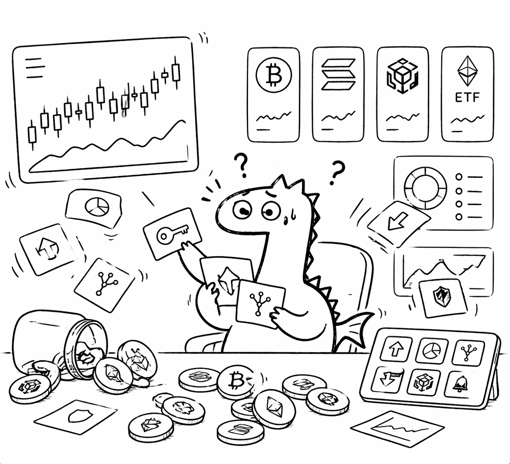
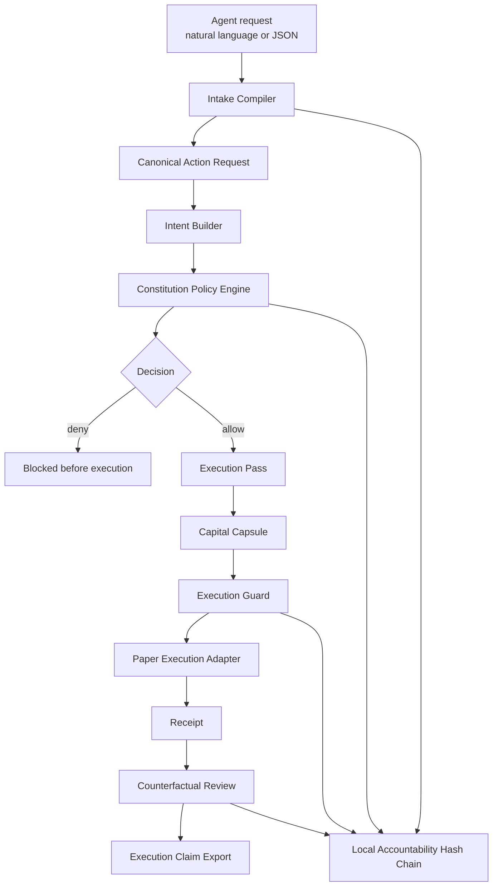

# LeviathanMatrix AEP Open Core

**Open execution-control infrastructure for Web4 agents: policy-bound authorization, Execution Passes, Capital Capsules, receipts, and reviewable actions.**

LeviathanMatrix AEP Open Core is an open-source execution-control layer for
autonomous agents with a live Solana Devnet proof anchor.

It turns an agent request such as `buy 1 USDC of SOL` into a governed execution
lifecycle, then anchors the lifecycle result to Solana as compact hash
commitments:

```text
request -> structured intent -> policy decision -> execution pass -> capital capsule -> bounded execution -> receipt -> review -> accountable claim
```

The core claim is simple:

> In Web4, an agent should not be able to move capital just because it can produce a prompt, hold a key, or call a tool. It should need a policy-bound, time-limited, cryptographically anchored execution object.

## Live Solana Devnet Proof

AEP Open Core now includes a minimal Anchor program deployed on Solana Devnet.
The AEP engine makes the execution decision, and Solana records the proof
anchor.

Program ID:

```text
5LY2YsVpAhES2nq9TT7iQn4gGAy8vdb4nkE3XyQzMw4q
```

Confirmed Devnet proof-anchor transaction:

```text
57c51zE8QZ3vrZ4My5Jgp1ssFAhEP8vRa72X8apg8QKxE3VSCY1J1gQCU8SZFU83gu2XTryWopGZvTRd4P6SV5Qx
```

Explorer:

```text
https://explorer.solana.com/tx/57c51zE8QZ3vrZ4My5Jgp1ssFAhEP8vRa72X8apg8QKxE3VSCY1J1gQCU8SZFU83gu2XTryWopGZvTRd4P6SV5Qx?cluster=devnet
```

Case anchor PDA:

```text
6anfG5xVC57Vsp2SxxQF9nnRQCSrU48WNeAhMBDTf952
```

The on-chain account stores hash commitments for the case, Execution Pass,
Capital Capsule, receipt, review, and accountability log head. It does not
store raw prompts, private keys, full policy files, or private agent strategy.

See [Solana Devnet Proof Anchor](docs/solana-devnet-proof-anchor.md) for the
architecture and reproduction path.

## Agent Runtime Demo Videos

These videos show an external Hermes agent using AEP as the execution-control
boundary. The first demo shows a successful governed execution flow. The second
demo shows the agent pulling the audit/log output after execution.

| Demo | What It Shows | Video |
| --- | --- | --- |
| Hermes Agent AEP Execution | Agent request routed through AEP authorization, execution, receipt, and review | [Watch MOV](docs/assets/demo/hermes-agent-aep-execution.mov) |
| Hermes Agent Audit Log Pull | Agent retrieves the post-execution audit/log output | [Watch MOV](docs/assets/demo/hermes-agent-aep-audit-log.mov) |

## Self-Hosted By Design

Developers can run AEP Open Core on their own machine or inside their own agent
runtime. The open-core path does not require a LeviathanMatrix server, a hosted
API, or a LeviathanMatrix wallet.

When a developer wants to create a Solana proof anchor, they use their own
Solana Devnet wallet to pay the Devnet transaction fee and create their own
anchor account.

## AEP Visual Story

Without an execution-control layer, an agent can receive broad authority, lose
control during execution, and expose sensitive authority surfaces.

| Permission without boundaries | Unbounded token activity | Key and authority leakage |
| --- | --- | --- |
|  |  |  |

With AEP, the same agent receives bounded authority before execution and leaves
behind a reviewable lifecycle after execution.

| Execution Pass | Capital Capsule | Receipt and Review |
| --- | --- | --- |
|  |  |  |

## 中文介绍

**LeviathanMatrix AEP Open Core 是面向 Web4 Agent 的开源执行控制基础设施。**

当前版本已经包含 Solana Devnet 上的最小证明锚点程序：AEP 在开发者自己的环境里完成授权、签发、胶囊、回执和审核，然后把结果哈希锚定到 Solana Devnet，形成可公开查看的链上证明。

它解决的不是“让 AI Agent 会调用工具”这个低层问题，而是更关键的问题：

```text
当 Agent 准备触碰资金、资产、权限或链上动作时，
谁给它授权？
授权范围有多大？
额度是多少？
有效期多久？
执行前后是否一致？
失败或越界时能不能被拦住并复盘？
```

AEP 把一句普通的 Agent 请求，例如 `buy 1 USDC of SOL`，转成一条可治理的执行生命周期：

```text
请求 -> 结构化意图 -> 策略判断 -> Execution Pass -> Capital Capsule -> 受控执行 -> Receipt -> Review -> 可导出的执行声明
```

一句话讲清楚：

> AEP 不是交易机器人，也不是提示词安全层。它是 Agent 在执行高价值动作之前必须经过的执行控制内核。

它让 Agent 的动作变成：

- 有策略边界；
- 有授权对象；
- 有额度限制；
- 有时间限制；
- 有执行回执；
- 有执行后审核；
- 可以被开发者复现和检查。

Solana 是当前仓库的第一演示环境，因为它速度快、费用低、适合机器级执行流。但 AEP 的核心设计不是只服务单条链，而是服务 Web4 Agent 的执行边界。

## Why AEP Exists

Crypto infrastructure was designed around human wallets. Web4 pushes execution into agent systems that can read markets, request actions, operate continuously, and touch capital at machine speed.

That breaks the old model.

Human-wallet UX asks:

```text
Did the user click approve?
```

Agent execution needs to ask:

```text
Who is the agent acting for?
What role is it using?
What action is it allowed to perform?
What is the max notional?
Which program and network are allowed?
How long is the authority valid?
Was the execution still inside the original capability?
Can the result be reviewed without trusting the prompt?
```

AEP is the missing execution boundary between agent reasoning and capital movement.

## What Makes It Different

Most agent demos connect a model directly to a tool. That is fast, but it is not governable.

AEP inserts a deterministic control plane before execution:

- natural-language and structured requests compile into one normalized action model
- policy rules are evaluated against a constitution document
- risk inputs are schema-validated and machine-readable
- allowed actions receive an Execution Pass
- capital movement is wrapped in a Capital Capsule
- execution is rejected if the pass or capsule no longer matches the request
- receipts and reviews create an accountable lifecycle around the action

This is not a prompt wrapper. It is an execution kernel.

## Repository Scope

This repository includes the open AEP implementation:

- policy and constitution engine
- intake compiler
- delegation grant resolver
- Execution Pass issuance
- Capital Capsule lifecycle
- bounded execution adapter for reproducible demos
- receipt and review pipeline
- accountability hash chain
- Solana Devnet proof-anchor program
- CLI and examples
- schemas, fixtures, and tests

Public spec id:

```text
leviathanmatrix.aep.open-core.v1
```

Core runtime dependencies:

```text
none
```

Development and Solana proof-anchor dependencies:

```text
pytest
anchor
node/npm
@coral-xyz/anchor
```

## How Developers Use It

AEP Open Core can be used in four modes.

### Mode 1: CLI Boundary For Demos And Hackathons

Use the CLI when you want to show the full lifecycle quickly:

```bash
python scripts/aep_cli.py run-text \
  --text "buy 1 USDC of SOL" \
  --agent-id demo-agent
```

This runs:

```text
intake -> policy -> pass issuance -> capsule binding -> execution guard -> receipt -> review
```

### Mode 2: Python Library Inside An Agent Runtime

Use the library when another agent framework wants AEP as a pre-execution control plane:

```python
from aep.kernel import authorize_action, execute_case, review_case, export_execution_claim

case = authorize_action(
    text="buy 1 USDC of SOL",
    agent_id="demo-agent",
)

case = execute_case(case)
case = review_case(case)
claim = export_execution_claim(case)
```

The agent does not need to understand the internals. It needs to respect the boundary:

```text
if AEP does not authorize, the agent does not execute
```

### Mode 3: Structured Request Adapter

Use structured requests when a production runtime already has typed action objects:

```text
agent action JSON
-> AEP intake
-> constitution policy
-> execution pass
-> capital capsule
-> guarded execution
```

The same AEP kernel handles natural language and structured requests, which makes it portable across agent stacks.

### Mode 4: Solana Devnet Proof Anchor

Use the Anchor proof program when you want the AEP lifecycle result to have a
public Solana verification surface:

```text
AEP lifecycle -> hash commitments -> Solana Devnet proof anchor PDA
```

This mode still does not require a LeviathanMatrix server. It uses the
developer's own Devnet wallet.

See:

- [Installation](docs/installation.md)
- [Developer Usage](docs/developer-usage.md)
- [Features And Configuration](docs/features-and-configuration.md)
- [Reproducible Execution Cases](docs/reproducible-execution-cases.md)
- [Solana Devnet Proof Anchor](docs/solana-devnet-proof-anchor.md)
- [Architecture](docs/aep-open-core-architecture.md)
- [Algorithm Notes](docs/algorithm-notes.md)
- [Design Rationale](docs/design-rationale.md)
- [Security Model](docs/security-model.md)
- [Hackathon Demo Guide](docs/hackathon-demo-guide.md)

## Quickstart

```bash
python3 -m venv .venv
. .venv/bin/activate
pip install -r requirements.txt
pytest -q -p no:cacheprovider
```

For a full install and troubleshooting path, see [Installation](docs/installation.md).

Run an end-to-end governed action:

```bash
python scripts/aep_cli.py run-text \
  --text "buy 1 USDC of SOL" \
  --agent-id demo-agent
```

Representative output:

```json
{
  "ok": true,
  "producer": {
    "company": "LeviathanMatrix",
    "product": "AEP",
    "project": "LeviathanMatrix AEP Open Core",
    "component": "cli_summary",
    "version": "0.1.0",
    "spec_id": "leviathanmatrix.aep.open-core.v1",
    "implementation": "leviathanmatrix-aep-open-core"
  },
  "authorization": {
    "status": "AUTHORIZED",
    "issuance_id": "iss_...",
    "capsule_id": "capsule_..."
  },
  "execution": {
    "status": "EXECUTED",
    "execution_id": "exec_...",
    "tx_id": "tx_..."
  },
  "receipt": {
    "status": "EXECUTED"
  },
  "review": {
    "status": "PASSED"
  }
}
```

## Architecture



## Core Objects

### 1. Action Request

The intake layer compiles messy agent input into a normalized action request.

Supported action classes include:

- trade
- payment
- approve
- bridge
- contract call

The important point is not keyword parsing. The important point is that every runtime-facing request becomes the same deterministic object before policy evaluation.

### 2. Constitution

The constitution is a machine-readable policy document. It defines hard boundaries such as:

- allowed chains
- allowed and forbidden programs
- per-transaction notional cap
- daily notional cap
- slippage limit
- counterparty requirements
- bridge exposure limit
- leverage limit
- simulation requirement

Hard-constraint failures produce explicit reason codes such as:

```text
HC_CHAIN_NOT_ALLOWED
HC_PROGRAM_NOT_ALLOWED
HC_NOTIONAL_EXCEEDED
HC_DAILY_LIMIT_EXCEEDED
HC_SLIPPAGE_EXCEEDED
HC_COUNTERPARTY_SCORE_LOW
HC_BRIDGE_EXPOSURE_EXCEEDED
HC_LEVERAGE_EXCEEDED
HC_SIMULATION_REQUIRED
```

### 3. Policy Decision

The policy engine converts structured risk and constitution state into one of:

```text
ALLOW_WITH_LIGHT_BOND
ALLOW_WITH_STANDARD_BOND
ALLOW_WITH_HEAVY_BOND
DENY
```

The engine is deterministic. The same constitution, intent, risk input, and prior state produce the same decision.

### 4. Execution Pass

An Execution Pass is the pre-execution permission object.

It contains:

- issuance id
- pass id
- status
- TTL
- scope
- policy decision basis
- capability hash

The capability hash binds the pass to:

- case id
- request id
- agent id
- action payload
- execution scope
- policy decision
- policy reason codes
- delegation identity

If the request changes after authorization, the capability hash changes and execution fails closed.

### 5. Capital Capsule

A Capital Capsule is a bounded capital envelope for the action.

It contains:

- max notional
- consumed notional
- remaining notional
- valid time window
- bound pass id
- execution mode
- pricing profile
- status history
- capsule hash

The capsule prevents open-ended agent authority. It can be issued, armed, consumed, exhausted, revoked, expired, or finalized.

### 6. Receipt And Review

Execution produces a receipt. Review then checks whether the action completed under the expected authorization context.

The review layer also generates counterfactual policy views across strict, baseline, and lenient thresholds, which makes the post-action result easier to reason about.

## Algorithmic Core

### Structural Risk Aggregation

The open risk schema uses eight machine-readable risk axes:

```text
r1_control
r2_funding
r3_convergence
r4_terminal
r5_history
r6_lp_behavior
r7_anomaly
x_cross_signal
```

The structural score is weighted:

```text
base =
  0.18 * r1_control
+ 0.17 * r2_funding
+ 0.12 * r3_convergence
+ 0.10 * r4_terminal
+ 0.10 * r5_history
+ 0.13 * r6_lp_behavior
+ 0.10 * r7_anomaly
+ 0.10 * x_cross_signal

token_penalty =
  weighted_score
  or 0.40 * permission + 0.35 * rug + 0.25 * history + adjustment

structural_risk = clamp(0.80 * base + 0.20 * token_penalty)
```

### AEP Risk Score

The policy score combines structural risk with execution context:

```text
raw =
  0.30 * structural_risk
+ 0.15 * counterparty_risk
+ 0.15 * execution_complexity_risk
+ 0.10 * market_risk
+ 0.10 * anomaly_risk
+ 0.10 * evidence_gap_risk
+ 0.10 * governance_surface_risk

bonus =
  0.10 * agent_reputation_bonus
+ 0.10 * treasury_health_bonus

effective_bonus = min(bonus, raw * 0.80)
risk_score_pre_advisory = clamp(raw - effective_bonus)
```

The 80 percent bonus cap prevents reputation or treasury strength from reducing risk to a meaningless zero.

### Advisory Floor

Advisory decisions impose a minimum score:

```text
ALLOW  -> allow_floor_score
REVIEW -> review_floor_score
BLOCK  -> block_floor_score
```

This prevents a low numeric score from overriding a stronger review or block signal.

### Decision Bands

The constitution maps final risk into execution posture:

```text
risk < allow_light_max     -> ALLOW_WITH_LIGHT_BOND
risk < allow_standard_max  -> ALLOW_WITH_STANDARD_BOND
risk < allow_heavy_max     -> ALLOW_WITH_HEAVY_BOND
otherwise                  -> DENY
```

Heavy-bond actions do not become ordinary execution passes. They are treated as review-heavy execution posture and fail closed unless the downstream path explicitly supports that posture.

### Capsule Pressure

Capital Capsule pressure is independently computed:

```text
pressure =
  risk_weight * open_risk_score
+ volatility_weight * volatility_proxy * 100
+ mode_penalty
+ review_penalty
```

The result drives:

- review intensity
- mode restriction
- revocation sensitivity
- advisory limit multiplier
- advisory TTL multiplier

This means execution authority is not only a yes-or-no decision. It becomes a shaped, time-aware capital object.

### Capability Hash

The Execution Pass uses a stable hash over the action and authority tuple:

```text
capability_hash = sha256(canonical_action_scope + policy_basis + delegation_identity)
```

If any of these change:

- action kind
- action payload
- agent id
- request id
- policy result
- delegation grant
- execution scope

the pass no longer validates.

## Why Solana

AEP is chain-aware, but Solana is the most natural first environment for Web4 agent execution.

Solana matters because:

- low fees make high-frequency machine checks economically practical
- fast confirmation compresses the time between decision and execution
- high throughput makes agent-native workflows realistic
- Solana already has strong developer mindshare around autonomous payments, x402-style flows, and machine-native commerce
- the long-tail token environment creates a real need for execution boundaries instead of raw agent freedom

Slow systems can hide weak control behind latency. Fast systems expose weak control immediately.

If agents operate at Solana speed, execution policy also has to operate at Solana speed.

In other words:

```text
Solana makes autonomous capital movement realistic.
AEP makes autonomous capital movement governable.
```

## Demo Commands

Authorize only:

```bash
python scripts/aep_cli.py authorize-text \
  --text "buy 1 USDC of SOL" \
  --agent-id demo-agent
```

Run the full lifecycle:

```bash
python scripts/aep_cli.py run-text \
  --text "buy 1 USDC of SOL" \
  --agent-id demo-agent
```

Export a public execution claim:

```bash
python scripts/aep_cli.py export-claim \
  --case-id <case_id>
```

Verify an execution pass:

```bash
python scripts/aep_cli.py verify-pass \
  --case-id <case_id>
```

Verify a capital capsule:

```bash
python scripts/aep_cli.py verify-capsule \
  --case-id <case_id>
```

## Tests

```bash
pytest -q -p no:cacheprovider
```

Current coverage includes:

- intake compilation
- policy decisions
- risk input schema compatibility
- delegation resolution
- Execution Pass issuance and validation
- Capital Capsule binding and consumption
- end-to-end execution lifecycle
- receipt and review handling
- accountability hash-chain replay

## For Judges

This repository is intentionally runnable and has a live Solana Devnet proof
anchor.

The fastest way to evaluate it:

1. run tests
2. run the quickstart command
3. inspect the generated case under `artifacts/cases`
4. export the execution claim
5. mutate the case or request scope and observe validation fail closed

The product value is not that an agent can print an execution trace. The value is that agent execution becomes:

- policy-bound
- time-limited
- notional-limited
- hash-anchored
- reviewable
- portable across runtimes

That is the execution control layer Web4 agents need before they can be trusted with capital.

## License

This repository is released under the LeviathanMatrix AEP Open Core
Non-Commercial License v1.0.

Personal, educational, research, hackathon, evaluation, and internal
non-commercial use are allowed.

Commercial use requires permission from LeviathanMatrix. See [LICENSE](LICENSE).
