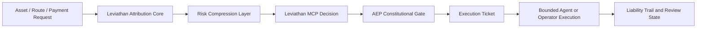

# Leviathan Frontier

**Solana-native constitutional execution and pre-trade decision infrastructure for autonomous agents and human operators.**

Leviathan is being built for a simple shift: once agents begin screening assets, requesting capital, and executing actions directly, crypto stops being only a wallet problem and becomes a decision, identity, and liability problem.

This project combines three layers into a single execution stack:

- **Attribution Core**: turns messy on-chain behavior into usable risk, control, and evidence context
- **Leviathan MCP**: exposes machine-consumable `ALLOW / REVIEW / BLOCK` decisions instead of raw noise
- **AEP (Agent Execution Policy)**: binds execution to policy, authority, and liability boundaries before capital can move

Leviathan is not a token checker, not an execution bot, and not a dashboard-first product. It is infrastructure for deciding whether an agent action should exist on-chain at all, under what policy, and with what accountability.

## The Web4 Execution Gap

The current crypto stack was designed for human wallets, human approvals, and human responsibility. That model degrades once autonomous systems begin acting on capital.

### 1. Agent analysis is too expensive

Today, a serious agent often has to ingest raw on-chain data, inspect wallet behavior, reason across multiple protocols, and interpret fragmented signals just to answer one basic question:

**Should I touch this asset at all?**

That creates real failure modes:

- too much latency before execution
- too much token and compute cost spent on repeated analysis
- too much overhead relative to the profit opportunity
- too much chance of paying more for analysis than the decision is worth

An agent that must repeatedly burn context, token budget, and engineering complexity before every action is leaking value before it even trades.

### 2. Identity is not enough without execution policy

On-chain identity can tell you who owns a wallet or who signed a request. It does **not** tell you whether the requested action should be allowed.

Autonomous systems need more than identity:

- what role is this agent acting under
- what asset classes is it allowed to touch
- what actions require escalation
- what should be blocked even if the strategy wants to proceed
- what authority survives role changes, operator changes, or delegation

Without explicit execution policy, identity becomes a weak shell around uncontrolled automation.

### 3. Most tools stop at data, not decisions

Most crypto tools still output:

- traces
- dashboards
- alerts
- disconnected scores
- opaque heuristics

That is not enough for agents.

Agents need a machine-usable decision object that can be routed directly into policy and execution.

### 4. Accountability is still broken

When an automated system acts on capital, the same questions appear every time:

- why did this happen
- what evidence supported it
- which policy boundary allowed it
- who is responsible if it was wrong

Most stacks cannot answer those questions cleanly. They produce fragments, not an execution-grade liability trail.

## Why This Market Matters

This is not a niche interface problem. It sits inside the broader shift from software assistance to autonomous software action.

- McKinsey estimates generative AI could create **$2.6T-$4.4T** in annual economic value across industries when deployed at scale.
- Solana is already explicitly positioning for **agentic payments** and machine-to-machine economic flows.
- Solana's x402 ecosystem page highlights **37M+ transactions**, **20K+ buyers and sellers**, and **70% monthly volume on Solana** in its current x402 ecosystem framing.
- Solana's agentic payments documentation now treats machine-native payment negotiation as a first-class internet primitive rather than a thought experiment.

As agents begin to pay for data, request capital, evaluate routes, screen assets, and execute actions continuously, the market for **decision infrastructure, execution policy, and machine accountability** grows with them.

Leviathan is designed for that layer.

## Why Solana

Solana is the right execution environment for this stack because the constraints are real there:

- low fees make repeated machine calls economically viable
- fast finality compresses the time window for bad decisions
- high throughput makes agent-native workflows realistic instead of theoretical
- native support for agentic payments and x402 makes machine commerce economically credible

A slow chain can tolerate slow judgment.

Solana cannot.

If capital moves quickly, decision and policy infrastructure must also move quickly.

## What Leviathan Does

### Attribution Core

Leviathan's attribution layer compresses raw on-chain complexity into a usable decision surface:

- funding provenance
- control surface exposure
- permission posture
- liquidity structure
- issuer and recurrence context
- evidence packaging for operator and machine review

This matters because agents should not have to reverse-engineer every token from scratch every time they evaluate a possible action.

### Leviathan MCP

Leviathan MCP exposes decisions in a form agents can actually use:

- `ALLOW`
- `REVIEW`
- `BLOCK`

with confidence and evidence context.

The point is simple:

**agents should consume decisions, not drown in analytics.**

### AEP

AEP is the constitutional execution layer.

Its role is not to optimize gas or routing. Its role is to govern whether an action is legitimate to execute under policy at all.

AEP is designed to enforce:

- explicit authority boundaries
- role-aware execution limits
- no ticket, no execution
- liability-aware action control
- accountable case history around every major action

This is how autonomous execution becomes governable instead of merely fast.

## High-Level Flow

## Why This Is Infrastructure

Leviathan does not sit at the cosmetic layer.

It sits where machine actions become legitimate, constrained, and reviewable.

That makes it useful for:

- agent trading systems
- machine-assisted diligence
- token screening before listing or allocation
- internal operator review
- controlled execution in high-speed markets
- future machine-to-machine finance on Solana

## Hackathon Direction

For this hackathon, the goal is to ship a clearer public product surface around the Leviathan stack:

- tighter AEP framing for constitutional execution
- clearer machine-facing decision contracts
- stronger public-facing product narrative
- more judge-friendly demonstration of how attribution and AEP work together
- continued hardening of the decision stack as infrastructure, not a one-off demo

## Latest Update

The latest AEP update pushes Leviathan beyond delegated execution checks and into a stronger model of capital-bound execution control.

- introduced **Capital Capsules** as bounded execution objects for delegated actions
- turned execution authority into something temporary, scoped, revocable, and review-settleable rather than a flat yes-or-no approval
- added lifecycle-aware execution control so a bounded execution object can be issued, consumed, revoked, and settled across the action path
- strengthened pre-execution legitimacy by rechecking whether delegated authority still holds at the moment execution is attempted
- moved review closer to execution settlement, not just retrospective status inspection
- extended the public product story from constitutional execution toward accountable machine capital control

See [docs/current-update-capital-capsule.md](docs/current-update-capital-capsule.md) for the latest update and [docs/week-1-update.md](docs/week-1-update.md) for the earlier delegation milestone.

## Week 2 Update

Week 2 focused on turning AEP into a cleaner runtime-facing infrastructure layer instead of leaving it as a prompt-shaped execution demo.

- introduced a unified intake layer so plain-language requests and structured requests now resolve into the same governed execution path
- pushed Capital Capsules from a concept/demo surface into the real execution lifecycle with issuance, consumption, review, and settlement on live case paths
- expanded governed action coverage beyond trade into bridge so machine execution boundaries can cover more than one capital movement primitive
- hardened the runtime story so agent frameworks can route into AEP more consistently instead of depending on brittle one-off phrasing
- validated the new surface through local regression and live runtime checks across trade, bridge, and delegated capsule flows

See [docs/week-2-update.md](docs/week-2-update.md) for the full update.

## Runtime Access Alpha

We now have a controlled external runtime path for judges, collaborators, and selected testers.

- external users run a local runtime shell instead of receiving Leviathan source code
- the protected AEP, attribution, capsule, and audit logic stay behind the Leviathan decision boundary
- this creates a real hands-on product experience without publishing the internal execution-governance core
- the current public runtime path uses a lighter attribution path by default while the deeper attribution engine continues to be optimized

See [docs/runtime-access-alpha.md](docs/runtime-access-alpha.md) for the external runtime access shape and [docs/judge-runtime-access.md](docs/judge-runtime-access.md) for the reviewer-facing trial flow.

## Foundation Built During Colosseum Eternal

Leviathan is not starting from zero.

During Colosseum Eternal, we built and iterated the foundation that this hackathon version stands on:

- multi-surface attribution for funding, control, permissions, liquidity, and recurrence
- evaluator-facing `ALLOW / REVIEW / BLOCK` decision outputs
- public and private reporting paths
- MCP-facing decision delivery layer
- AEP framing for constitutional execution and liability-aware action control
- case review and decision workflow concepts
- graph and evidence presentation layers
- repeated live testing against real Solana assets and operator-facing review flows

That Eternal work is the foundation.

This hackathon repo is where that foundation becomes a sharper, cleaner, more explicit startup product.

## Repository Scope

This public repository is the hackathon-facing product and progress surface.

- public here: positioning, architecture, weekly updates, product framing, and future demo materials
- not public here: sealed production logic, proprietary attribution internals, non-public connectors, and private execution controls

The current goal is to make the product direction and progress legible without exposing the internal implementation that will later power the demo.

## References

- [Solana Agentic Payments](https://solana.com/docs/payments/agentic-payments)
- [Solana x402 on Solana](https://solana.com/x402)
- [What is x402?](https://solana.com/x402/what-is-x402)
- [McKinsey: The economic potential of generative AI](https://www.mckinsey.com/capabilities/mckinsey-digital/our-insights/the-economic-potential-of-generative-ai-the-next-productivity-frontier)
