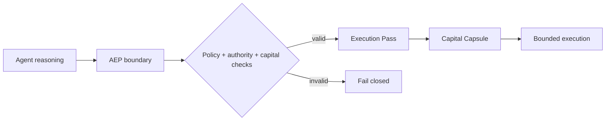
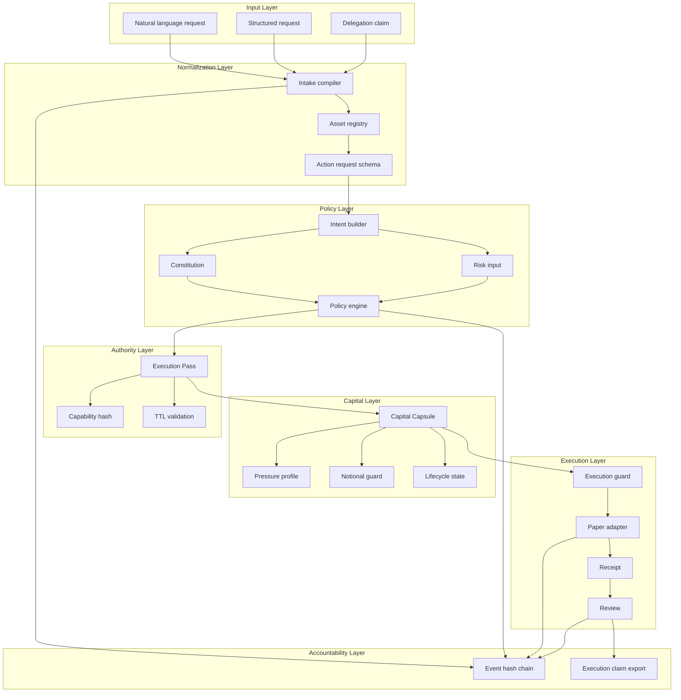
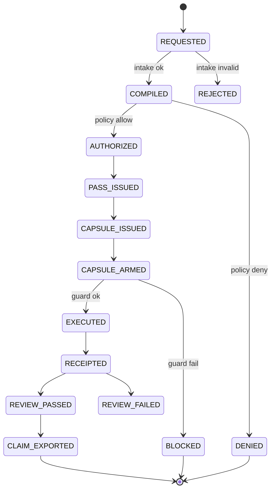

# AEP Open Core Architecture

This document describes the technical architecture of LeviathanMatrix AEP Open Core.

AEP stands for Agent Execution Policy. It is a deterministic execution-control kernel for autonomous agent actions.

## Design Goal

The design goal is to separate agent reasoning from execution authority.

An agent may suggest an action. AEP decides whether the action can become executable.



## Module Map



## Object Lifecycle



## Fail-Closed Invariants

AEP is built around fail-closed invariants:

- no compiled request, no policy decision
- no policy allow, no pass
- no valid pass, no execution
- no matching capability hash, no execution
- no active capsule, no execution
- no remaining notional, no execution
- expired pass or capsule cannot execute
- denied authorization cannot be upgraded by review

These invariants make the system boring in the best possible way: if the chain of authority breaks, execution stops.

## Execution Pass

The Execution Pass is the central permission object.

It is not a text approval. It is a structured object with:

- `issuance_id`
- `pass_id`
- `status`
- `issued_at`
- `expires_at`
- `scope`
- `capability_hash`

The pass is short-lived and bound to the request state.

## Capital Capsule

The Capital Capsule turns capital authority into a finite object.

It limits:

- maximum notional
- remaining notional
- valid time
- execution mode
- bound pass id

It tracks state transitions:

```text
ISSUED -> ARMED -> PARTIALLY_CONSUMED -> EXHAUSTED
ISSUED -> REVOKED
ISSUED -> EXPIRED
EXHAUSTED -> FINALIZED
```

The point is direct: an agent should not receive infinite reusable authority when one bounded action is enough.

## Hash Anchors

AEP uses deterministic hashes for integrity:

- capability hash binds the pass to the request and policy context
- capsule hash binds the capsule to its state
- accountability event hash links local events into a replayable chain

This gives developers a stable way to detect mutation without trusting the agent's narration.

## Producer Metadata

Every major exported object includes:

```json
{
  "producer": {
    "company": "LeviathanMatrix",
    "product": "AEP",
    "project": "LeviathanMatrix AEP Open Core",
    "spec_id": "leviathanmatrix.aep.open-core.v1"
  }
}
```

This gives downstream systems a stable origin marker without adding any closed-source dependency.
