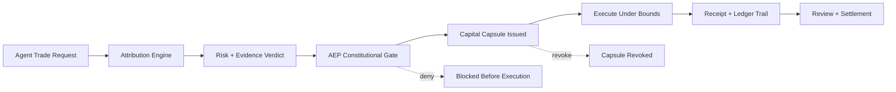

# Current Update: Capital Capsule Execution Layer

The newest AEP milestone moves Leviathan from delegation-aware execution toward a more serious model of bounded machine capital control.

This update is not about adding more surface-level policy fields. It changes what execution authority looks like inside the system.

Instead of treating delegated execution as a static permission check, Leviathan can now represent bounded execution rights as a temporary execution object: a **Capital Capsule**.

## What Changed

### 1. Delegated authority can now be wrapped into a Capital Capsule

Approved delegated execution is no longer just a pass-or-fail state.

It can now be carried forward as a bounded execution object with public product-facing properties such as:

- scoped action legitimacy
- bounded notional capacity
- bounded lifetime
- bounded execution mode
- review intensity and post-action closure

That is a stronger execution model than a flat approval because it gives machine action a temporary, governed capital envelope instead of a broad reusable permission.

### 2. Execution is now controlled across a lifecycle, not one moment

The execution path now supports a more complete lifecycle around delegated capital use:

- issue
- consume
- revoke
- settle

This matters because serious machine execution infrastructure should not only decide whether an action may begin. It should also track how bounded authority evolves through execution and review.

### 3. Live legitimacy matters at execution time

This update strengthens the idea that authorization alone is not enough.

Execution now depends on whether the delegated execution state still holds when the action is actually attempted.

That moves Leviathan closer to a model where machine execution remains governed in motion, not just governed at the entry point.

### 4. Review is now closer to settlement

Review is no longer only a lightweight retrospective check.

The system now treats review as part of execution closure:

- whether the action remained within its bounded authority
- whether the execution object should resolve cleanly
- whether the action path should be treated as completed or flagged

That is a more infrastructure-grade posture for accountable agent execution.

## Why This Matters

This update moves Leviathan from:

- constitutional execution gating

toward:

- constitutional machine capital control

The difference is important.

The system is no longer only asking:

- should this action be allowed?

It is now closer to asking:

- under what bounded capital object should this action exist?
- how long should that authority remain valid?
- when should that authority stop being executable?
- how should that authority be closed and reviewed after use?

That is a stronger foundation for future machine finance on Solana than a simple policy gate alone.

## Public Boundary

This repository continues to document the public product and governance surface of the hackathon work.

It does **not** expose sealed production logic, proprietary attribution internals, or private execution control methods.

The purpose of this update is to show product progress and infrastructure direction without opening the internal engine.
