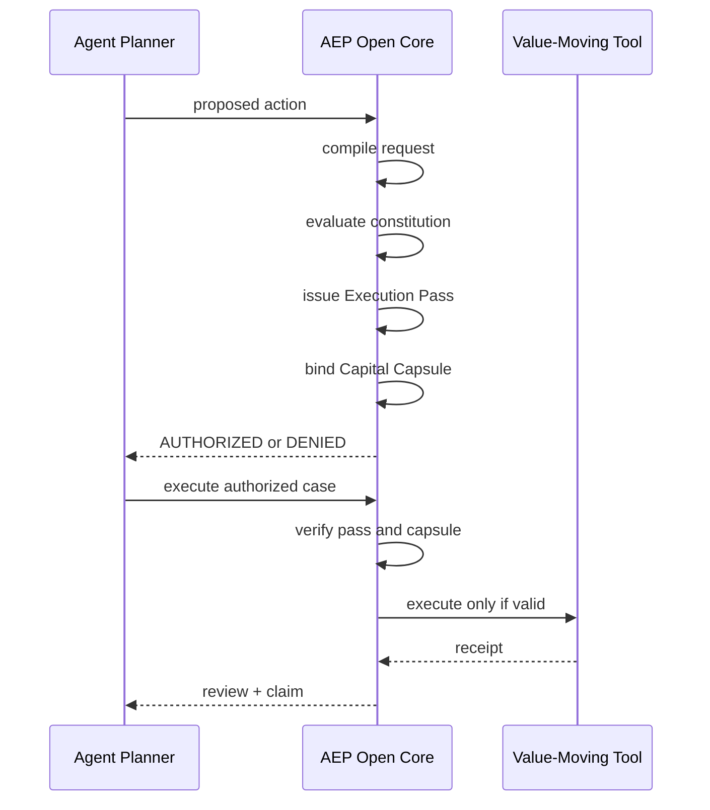

# Developer Usage

This document explains how another developer, agent team, or hackathon judge can use LeviathanMatrix AEP Open Core.

The shortest version:

```text
Put AEP between the agent and the value-moving tool.
The agent proposes.
AEP authorizes.
Only then does execution happen.
```

## 1. Install

```bash
python3 -m venv .venv
. .venv/bin/activate
pip install -r requirements.txt
```

Run the test suite:

```bash
pytest -q -p no:cacheprovider
```

## 2. Use AEP From The CLI

### Run Full Lifecycle

```bash
python scripts/aep_cli.py run-text \
  --text "buy 1 USDC of SOL" \
  --agent-id demo-agent
```

This command performs:

```text
compile request
evaluate policy
issue Execution Pass
create Capital Capsule
validate execution guard
execute paper action
ingest receipt
run review
return summary
```

### Authorize Without Executing

```bash
python scripts/aep_cli.py authorize-text \
  --text "buy 1 USDC of SOL" \
  --agent-id demo-agent
```

This is the pre-execution gate. It lets an agent ask:

```text
Can I do this action under policy?
```

without executing.

### Execute A Saved Case

```bash
python scripts/aep_cli.py execute-case \
  --case-id <case_id>
```

### Simulate A Saved Case

```bash
python scripts/aep_cli.py simulate-case \
  --case-id <case_id>
```

### Review A Saved Case

```bash
python scripts/aep_cli.py review-case \
  --case-id <case_id>
```

### Export Claim

```bash
python scripts/aep_cli.py export-claim \
  --case-id <case_id>
```

### Verify Pass

```bash
python scripts/aep_cli.py verify-pass \
  --case-id <case_id>
```

### Verify Capsule

```bash
python scripts/aep_cli.py verify-capsule \
  --case-id <case_id>
```

## 3. Use AEP As A Python Library

```python
from aep.kernel import (
    authorize_action,
    execute_case,
    review_case,
    export_execution_claim,
)

case_doc = authorize_action(
    text="buy 1 USDC of SOL",
    agent_id="demo-agent",
)

case_doc = execute_case(case_doc)
case_doc = review_case(case_doc)
claim = export_execution_claim(case_doc)
```

The important integration rule:

```python
if case_doc["authorization"]["status"] != "AUTHORIZED":
    raise RuntimeError("AEP denied execution")
```

## 4. Use AEP In An Agent Runtime

AEP should sit between the agent planner and the execution adapter.



The agent does not directly decide whether capital can move.

The agent proposes an action. AEP turns that proposal into an executable or non-executable state.

## 5. Structured Request Pattern

A production agent can bypass natural language and submit a structured request.

Expected conceptual shape:

```json
{
  "agent": {
    "agent_id": "agent-123",
    "runtime_type": "custom-agent"
  },
  "action": {
    "kind": "trade",
    "trade": {
      "side": "buy",
      "source_asset": "USDC",
      "destination_asset": "SOL",
      "notional_usd": 1.0,
      "slippage_bps": 50
    }
  },
  "execution_preferences": {
    "chain": "solana",
    "network": "paper",
    "mode": "paper"
  }
}
```

AEP converts this into:

- policy intent
- policy decision
- Execution Pass
- Capital Capsule
- case record

## 6. How To Demo Failure

Run a request that violates the constitution notional cap:

```bash
python scripts/aep_cli.py run-text \
  --text "buy 1000000 USDC of SOL" \
  --agent-id demo-agent
```

Expected behavior:

```text
authorization.status = DENIED
execution.status = BLOCKED
review.status = FAILED
```

This shows fail-closed execution control.

## 7. What Developers Should Integrate

For a real agent runtime, integrate these functions first:

```python
authorize_action()
execute_case()
review_case()
export_execution_claim()
```

For a CLI or judge demo, use:

```text
scripts/aep_cli.py
```

For policy tuning, edit:

```text
fixtures/constitution.paper_trade.v1.json
```

For asset aliases and paper identifiers, edit:

```text
fixtures/paper_asset_registry.v1.json
```

For delegation scope, edit:

```text
fixtures/delegation_grants.v1.json
```

## 8. The Integration Contract

AEP exposes a simple contract:

```text
No valid Execution Pass -> no execution.
No active Capital Capsule -> no execution.
No matching capability hash -> no execution.
No remaining notional -> no execution.
No valid review path -> no trusted claim.
```

That is the whole point of the system.
