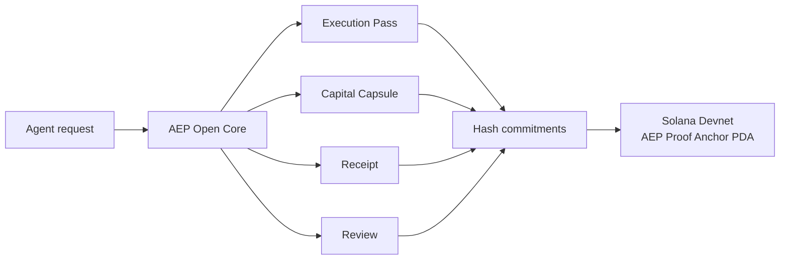

# Solana Devnet Proof Anchor

LeviathanMatrix AEP Open Core includes a minimal Anchor program that anchors
the output of an AEP execution lifecycle to Solana Devnet.

The goal is deliberately narrow:

```text
AEP makes the decision off-chain.
Solana records the proof anchor on-chain.
```

This gives judges and developers a real Solana transaction and account to
inspect without forcing private policy details, prompts, or full execution case
documents onto a public chain.

## Current Devnet Deployment

Program ID:

```text
5LY2YsVpAhES2nq9TT7iQn4gGAy8vdb4nkE3XyQzMw4q
```

Upgrade authority used for the demo deployment:

```text
Cco3ptQDqKWoXTSTq8oPuYi9hqtXYituh5JHzH3uhtWN
```

Confirmed proof-anchor transaction:

```text
57c51zE8QZ3vrZ4My5Jgp1ssFAhEP8vRa72X8apg8QKxE3VSCY1J1gQCU8SZFU83gu2XTryWopGZvTRd4P6SV5Qx
```

Explorer:

```text
https://explorer.solana.com/tx/57c51zE8QZ3vrZ4My5Jgp1ssFAhEP8vRa72X8apg8QKxE3VSCY1J1gQCU8SZFU83gu2XTryWopGZvTRd4P6SV5Qx?cluster=devnet
```

Case anchor PDA:

```text
6anfG5xVC57Vsp2SxxQF9nnRQCSrU48WNeAhMBDTf952
```

The transaction was finalized on Solana Devnet and invoked:

```text
CreateCaseAnchor
```

## What Goes On-Chain

The Anchor program stores a compact `AepCaseAnchor` account:

```text
schema_version
authority
case_id_hash
case_hash
pass_hash
capsule_hash
receipt_hash
review_hash
accountability_head_hash
verdict_code
created_at
bump
```

The on-chain account does **not** store:

- raw prompts;
- private keys;
- wallet secrets;
- full policy documents;
- full case JSON;
- private agent strategy.

This makes the Solana account a public proof anchor, not a data leak.

## Deployment Model

AEP Open Core is self-hosted by design.

Developers do not need to connect to a LeviathanMatrix server to run the
open-core engine. They can run the AEP lifecycle on their own machine or inside
their own agent runtime.

Developers also do not need to use a LeviathanMatrix wallet. If they want to
create new Solana proof anchors, they use their own Devnet wallet to sign the
transaction and pay the Devnet fee.

The public Devnet deployment above is a reference deployment for judges,
builders, and reviewers.

## Verdict Codes

```text
0 = UNKNOWN
1 = AUTHORIZATION_DENIED
2 = EXECUTION_BLOCKED
3 = EXECUTED_AND_REVIEW_PASSED
4 = EXECUTED_REVIEW_PENDING_OR_NON_PASSED
5 = REVIEW_FAILED
```

The current demo transaction used:

```text
3 = EXECUTED_AND_REVIEW_PASSED
```

## Architecture



The important design choice:

```text
The execution-control logic does not move on-chain.
Only the proof of the lifecycle result is anchored on-chain.
```

This keeps the system small, inspectable, and cheap to run.

## Reproduce Locally

Install Python and Node dependencies:

```bash
python3 -m venv .venv
. .venv/bin/activate
pip install -r requirements.txt
npm install
```

Build the Anchor program:

```bash
anchor build
```

If you are deploying your own copy of the program, generate a program keypair
before deployment:

```bash
mkdir -p target/deploy
solana-keygen new \
  --no-bip39-passphrase \
  --silent \
  --force \
  -o target/deploy/aep_proof_anchor-keypair.json
```

Then update `declare_id!(...)` in
`programs/aep-proof-anchor/src/lib.rs` and the program id in `Anchor.toml` to
match:

```bash
solana address -k target/deploy/aep_proof_anchor-keypair.json
```

Generate an AEP case and anchor payload:

```bash
python scripts/aep_anchor_payload.py \
  --text "buy 1 USDC of SOL" \
  --agent-id demo-agent
```

Deploy the program to Devnet:

```bash
solana program deploy target/deploy/aep_proof_anchor.so \
  --program-id target/deploy/aep_proof_anchor-keypair.json \
  --keypair <DEVNET_DEPLOYER_KEYPAIR> \
  --url https://api.devnet.solana.com \
  --use-rpc \
  --max-sign-attempts 20
```

Create a proof anchor account:

```bash
ANCHOR_PROVIDER_URL=https://api.devnet.solana.com \
ANCHOR_WALLET=<DEVNET_DEPLOYER_KEYPAIR> \
npx tsx scripts/anchor_case.ts
```

The script prints:

```text
program_id
case_anchor
authority
signature
explorer_url
```

## Why This Matters

With the Solana proof anchor, an AEP lifecycle can produce a real Devnet
transaction and a public Solana account that can be inspected independently.

That means the project is not only an execution-control kernel. It also has a
Solana verification surface for the lifecycle result.

This is the minimum useful Solana-facing footprint for the current open-core
stage: keep the control logic inspectable and developer-owned, then anchor the
result to Solana.
